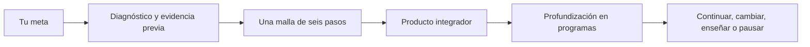
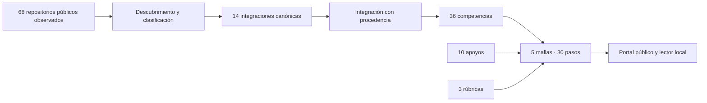

# Lifelong Learning Ecosystem

## Ecosistema Integral de Aprendizaje a lo Largo de la Vida

**Superrepositorio de Vladimir Acuña para conectar programas independientes, competencias, mallas de estudio, apoyos y criterios de evidencia desde la infancia y durante toda la vida.**

Esta es la capa de integración del ecosistema. Cada programa conserva su repositorio, identidad, numeración, licencia y profundidad disciplinar; el maestro registra procedencia, hace visibles las relaciones y construye recorridos que atraviesan varios programas. No duplica cursos completos ni se presenta como un programa adicional.

Una persona puede entrar en cualquier momento, reconocer lo que ya sabe, definir lo que desea alcanzar y construir un recorrido coherente entre distintas fuentes. Las mallas articulan objetivos observables, fundamento, práctica, evidencia, retroalimentación y continuidad.

**Versión inicial: 0.1.0 · Fecha de revisión de fuentes: 5 de octubre de 2026 · Idioma: español.**

## Por qué existe

La cuenta pública contiene programas profundos de matemática, software, IA, datos, empresa, finanzas, arquitectura, educación y otras áreas. El problema es que una colección de programas no le dice a una persona **dónde comenzar**, **qué conocimientos necesita**, **cómo cruzar disciplinas** ni **qué evidencia demuestra que puede continuar**.

Este repositorio convierte esa colección en una brújula:

| Pregunta de la persona | Respuesta del maestro |
| --- | --- |
| ¿Qué puedo hacer con lo que ya sé? | diagnóstico y reconocimiento de evidencia previa |
| ¿Qué camino responde a mi meta? | cinco mallas con seis pasos, productos y criterios |
| ¿Dónde profundizo una competencia? | enlaces a 14 programas y laboratorios con alcance documentado |
| ¿Qué apoyo uso si encuentro una barrera? | diez guías de apoyo vinculadas a actividades concretas |
| ¿Cómo sé si avanzo? | evidencias, rúbricas, transferencia y continuidad |

Puede imaginarse como la **capa de orientación de una universidad federada**: los repositorios especializados se parecen a facultades y las mallas conectan sus disciplinas. No es una universidad acreditada: no matricula, no asigna créditos, no entrega títulos y no homologa estudios. Lee [la explicación completa del sistema](docs/LEARNING_SYSTEM.md).

## Qué puedes recorrer ahora

No tienes que comenzar por M-01 ni recorrer todo. Elige por propósito en [las rutas concretas](docs/LEARNING_ROUTES.md), consulta [el atlas de programas](docs/PROGRAM_ATLAS.md) y usa [los mapas visuales](docs/ECOSYSTEM_MAP.md) para ver las conexiones.

## Explorar

1. Abre el [portal público](https://vladimiracunadev-create.github.io/lifelong-learning-ecosystem/) o descarga el repositorio para usarlo sin conexión.
2. En una copia local, abre [index.html](index.html). En Windows también puedes ejecutar [ABRIR_PORTAL.cmd](ABRIR_PORTAL.cmd).
3. Explora las 14 integraciones canónicas, las competencias, las cinco mallas, los apoyos y las rúbricas.
4. Consulta la [arquitectura actual verificada](docs/CURRENT_ARCHITECTURE.md), el [descubrimiento de repositorios](catalog/REPOSITORY_DISCOVERY.md) y [cómo elegir y retomar un recorrido](pathways/README.md).
5. Para continuar el desarrollo con un agente, utiliza el archivo íntegro [PROMPT_MAESTRO.md](PROMPT_MAESTRO.md).

El lector local contiene los datos y documentación de esta entrega. Las clases de los programas enlazados permanecen en sus repositorios y requieren conexión para consultarlas si no se han descargado previamente.

## Mapa rápido

El [mapa completo](docs/ECOSYSTEM_MAP.md) explica la arquitectura federada, el ciclo de aprendizaje y la continuidad exacta entre las cinco mallas.

## Qué contiene esta versión

| Componente | Entrega |
| --- | --- |
| Integraciones canónicas | Catálogo inicial de 14 repositorios con fuente y alcance de revisión; no es una lista cerrada de la cuenta |
| Descubrimiento | Corte documentado de 68 repositorios públicos: programas, laboratorios, productos, presencia pública y 4 forks separados |
| Competencias | 36 competencias con seis niveles descriptivos y relaciones de prerrequisitos |
| Mallas | Cinco recorridos con actividades puente originales, diagnóstico, evidencia y continuidad |
| Apoyos | Diez guías para lectura, escritura, matemática, estudio, idiomas, fuentes, accesibilidad, laboratorios, portafolio e IA |
| Evaluación | Tres rúbricas editoriales, reconocimiento previo y orientaciones de retroalimentación |
| Integración | Fichas por repositorio y reglas para seleccionar unidades respetando su estructura |
| Herramientas | Validador local, exportación de mallas, constructor del lector y empaquetado reproducible |
| Automatización | Calidad multi-entorno, CodeQL, actualización de acciones y publicación en GitHub Pages |
| Continuidad | Prompt maestro completo, instrucciones de agentes, decisiones y hoja de ruta |

Los conteos y resultados técnicos se registran en [el estado de entrega](quality/STATUS.md) y en el manifiesto de archivos. El catálogo es un inventario inicial; las áreas pendientes se registran explícitamente en [catalog/pending.json](catalog/pending.json).

## Los cinco recorridos

| Malla | Para qué sirve | Qué haces | Evidencia final | Abrir |
| --- | --- | --- | --- | --- |
| M-01 | recuperar bases y elegir continuidad | contrastas textos, interpretas datos, decides con un presupuesto y pruebas una propuesta | rincón lector, cálculos, revisión y portafolio breve | [M-01](curricula/M-01-continuidad-escolar.md) |
| M-02 | entrar a software o demostrar experiencia | especificas reglas, construyes un catálogo local, pruebas fallos y preparas operación | programa, pruebas, guía y caso técnico | [M-02](curricula/M-02-ingreso-especialidad-software.md) |
| M-03 | explorar una reconversión tecnológica | investigas un problema ficticio, defines un servicio, calculas alternativas y construyes una demostración | propuesta, demostración y caso de portafolio | [M-03](curricula/M-03-reconversion-consultoria-tecnologica.md) |
| M-04 | aprender mediante un proyecto interdisciplinario | observas un espacio, comparas soluciones, produces y pruebas un prototipo accesible | croquis, presupuesto, prototipo y plan operativo | [M-04](curricula/M-04-proyecto-comunitario-tecnologico.md) |
| M-05 | investigar por curiosidad y transmitir experiencia | contrastas recuerdos y fuentes, creas una pieza y diseñas una actividad para compartir | indagación, pieza expresiva y guion de enseñanza | [M-05](curricula/M-05-memoria-espacio-cultural.md) |

Las mallas completas están en [curricula](curricula/README.md). Su secuencia se expresa por dependencias de conocimiento. Las edades no acreditan competencias, y los calendarios personales se pueden ajustar sin cambiar los resultados esperados.

## Programas, laboratorio y apoyos

Las mallas actuales utilizan 13 programas. El laboratorio neuronal está catalogado, pero todavía no está conectado a una malla; esa brecha se conserva visible.

| Área | Repositorios usados |
| --- | --- |
| bases escolares y matemática | [Trayectoria Escolar](https://github.com/vladimiracunadev-create/chilean-school-learning-path) · [Matemática Computacional](https://github.com/vladimiracunadev-create/computational-mathematics-program) |
| software y seguridad | [Ingeniería de Software](https://github.com/vladimiracunadev-create/modern-software-engineering-program) · [Ciberseguridad](https://github.com/vladimiracunadev-create/modern-cybersecurity-program) |
| datos e IA | [Python y Ciencia de Datos](https://github.com/vladimiracunadev-create/python-data-science-program) · [Evolución de la IA](https://github.com/vladimiracunadev-create/artificial-intelligence-evolution-program) · [Neural Network Labs](https://github.com/vladimiracunadev-create/neural-network-training-labs) |
| empresa y decisiones | [Creación de Empresas](https://github.com/vladimiracunadev-create/modern-business-creation-program) · [Finanzas](https://github.com/vladimiracunadev-create/finance-and-banking-evolution-program) · [Marketing](https://github.com/vladimiracunadev-create/marketing-sales-growth-evolution-program) · [Liderazgo](https://github.com/vladimiracunadev-create/executive-leadership-founder-program) |
| espacio, enseñanza y evaluación | [Arquitectura](https://github.com/vladimiracunadev-create/architecture-built-environment-learning-program) · [Pedagogía](https://github.com/vladimiracunadev-create/education-pedagogy-learning-sciences-program) · [Psicometría](https://github.com/vladimiracunadev-create/psychometrics-and-assessment-program) |

El [atlas de programas](docs/PROGRAM_ATLAS.md) analiza uno por uno: aporte, estado observado, alcance de revisión, mallas vinculadas, enlaces y brechas. Los apoyos del maestro son guías documentales; las aplicaciones declaradas por programas externos no se consideran probadas por esta integración.

## Arquitectura

El maestro mantiene un catálogo común, competencias, mallas y correspondencias con los programas. Cada repositorio especializado sigue siendo la fuente de sus clases, prácticas y documentación.

Consulta la [arquitectura implementada](docs/CURRENT_ARCHITECTURE.md), los [diagramas de arquitectura y continuidad](docs/ECOSYSTEM_MAP.md), la [automatización de calidad y publicación](docs/AUTOMATION.md) y los [componentes propuestos, todavía no implementados](PROPOSED_COMPONENTS.md).

| Área | Responsabilidad |
| --- | --- |
| [catalog](catalog/README.md) | Integraciones canónicas, descubrimiento externo, declaraciones y alcance de revisión |
| [competencies](competencies/README.md) | Capacidades, progresión, evidencias y prerrequisitos |
| [curricula](curricula/README.md) | Mallas integradoras y actividades propias del maestro |
| [pathways](pathways/README.md) | Selección, ingreso, retorno y adaptación del recorrido |
| [assessment](assessment/README.md) | Evaluación, rúbricas y reconocimiento de experiencia |
| [support](support/README.md) | Apoyos a dificultades o necesidades concretas |
| [integrations](integrations/README.md) | Correspondencias con programas independientes |
| [sources](sources/README.md) | Fuentes y trazabilidad de las decisiones |
| [quality](quality/README.md) | Coherencia, revisión, brechas y estado |
| [docs](docs/README.md) | Diseño, uso local y evolución del proyecto |
| [examples](examples/README.md) | Ejemplos ficticios y portafolio local |
| [prompts](prompts/README.md) | Continuidad con agentes y registro de avances |

## Tres ejes de personalización

- **Etapa y contexto:** primera infancia acompañada, escolaridad, formación especializada, trabajo, reconversión, intereses personales y transmisión de experiencia.
- **Dominio por competencia:** exploración, fundamentos, aplicación acompañada, autonomía, profundización, creación e investigación.
- **Propósito:** comprender, crear, trabajar, investigar, emprender, convivir, enseñar o participar.

Una misma persona puede tener niveles diferentes en áreas distintas. Las decisiones de ingreso se basan en evidencias pertinentes y se revisan cuando aparece nueva información.

## Estado pedagógico

Las actividades puente, mallas, descriptores y rúbricas de esta entrega son propuestas editoriales desarrolladas y utilizables para revisión y pilotaje. Su eficacia no ha sido validada en una población de estudiantes.

La revisión inicial de las integraciones canónicas se apoya principalmente en README y enlaces observados. Una segunda inspección documentó otros repositorios reales sin asignarles automáticamente IDs ni equivalencias. La correspondencia exacta de cada clase con cada competencia requiere una auditoría posterior por unidades. Cada ficha distingue la declaración del programa, el alcance de la lectura y la revisión humana pendiente.

El [contrato de datos](docs/DATA_CONTRACT.md) separa estos estados. Un resultado técnico correcto comprueba coherencia de los archivos; la valoración del aprendizaje necesita evidencia y criterio educativo.

## Validar y reconstruir

Se requiere Python 3.11 o superior para las herramientas. Leer el portal no requiere Python.

Con uv, si ya está instalado:

~~~bash
uv run --offline python scripts/validate.py
uv run --offline python -m unittest discover -s tests -v
uv run --offline python scripts/build_portal.py --check
~~~

Con Python disponible en el equipo:

~~~bash
python scripts/validate.py
python -m unittest discover -s tests -v
python scripts/build_portal.py --check
~~~

Para regenerar el lector tras cambios:

~~~bash
python scripts/build_portal.py
~~~

En Windows se puede usar `py -3` en lugar de `python`. Consulta [el inicio en Windows](docs/START_WINDOWS.md) y [las instrucciones técnicas](docs/DEVELOPMENT.md).

## Continuar sin romper los programas

Antes de modificar un repositorio conectado, el agente debe leer sus instrucciones y fuentes actuales. Las decisiones sobre clases, numeración, licencias, estructura y derivados se realizan en ese programa y se documentan. La consulta del catálogo no autoriza modificaciones remotas.

El maestro incorpora actividades puente, equivalencias candidatas y mallas, y deja registro de su procedencia. Véase [AGENTS.md](AGENTS.md), [el prompt maestro](PROMPT_MAESTRO.md) y [la política de integración](docs/INTEGRATION_POLICY.md).

## Datos personales y licencias

El repositorio distribuido contiene ejemplos ficticios. Los planes y evidencias reales deben guardarse en una carpeta local privada; se incluyen exclusiones para `private/` y `exports/`.

Código original: [MIT](LICENSE). Contenido curricular original: [CC BY-NC-SA 4.0](LICENSE-CONTENT.md). Los programas y recursos enlazados conservan sus propias licencias.

## Fundamento y decisiones

La visión toma como referencia el aprendizaje durante toda la vida y las rutas flexibles descritos por UNESCO. El modelo de seis niveles, las mallas y las rúbricas concretas son decisiones propias de este proyecto, registradas para revisión.

- [Visión](VISION.md)
- [Diseño pedagógico](docs/PEDAGOGICAL_MODEL.md)
- [Decisiones de arquitectura](docs/DECISIONS.md)
- [Hoja de ruta](ROADMAP.md)
- [Historial](CHANGELOG.md)
