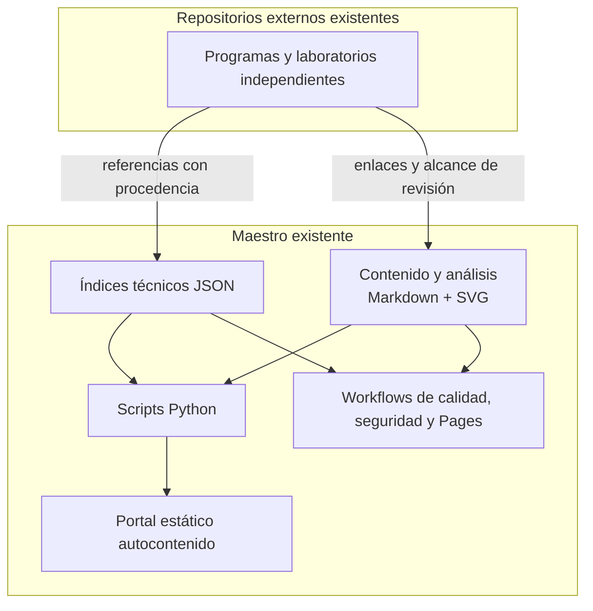
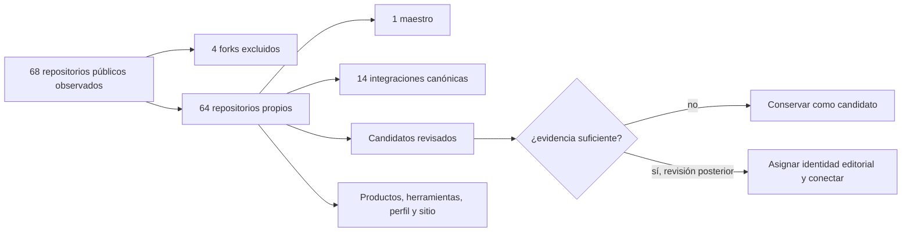

# Arquitectura actual verificada

Fecha de corte: **2026-10-05**.

Este documento describe únicamente lo que existe y puede comprobarse en este repositorio. Las posibilidades futuras se registran por separado en [PROPOSED_COMPONENTS.md](../PROPOSED_COMPONENTS.md).

## Regla de lectura

Se usan dos dimensiones que no deben confundirse:

- **Existencia:** el repositorio, archivo o proceso fue observado.
- **Madurez:** el alcance observado puede estar disponible, en desarrollo o declarado experimental.

Que un repositorio exista no prueba que todas las funciones descritas en su roadmap estén implementadas. Una declaración en un README se atribuye al repositorio de origen; solo una ejecución o inspección más profunda permite elevar su evidencia.

## Nivel 1: maestro existente

`vladimiracunadev-create/lifelong-learning-ecosystem` es un **superrepositorio federado existente**. Su función implementada es organizar referencias y producir un lector estático; no contiene copias completas de los cursos externos.

### Componentes implementados

| Componente | Estado | Evidencia local | Alcance comprobable |
| --- | --- | --- | --- |
| Campus documental | EXISTENTE | `docs/CAMPUS.md`, `docs/faculties/`, `docs/assets/` | seis áreas, gráficos y enlaces directos a repositorios reales |
| Flujos nativos | EXISTENTE | `docs/NATIVE_LEARNING_FLOWS.md` | 30 README educativos revisados y clasificados por su forma de avance |
| Catálogo federado | EXISTENTE | `catalog/programs.json` | 14 integraciones canónicas con `owner/name`, URL, alcance de revisión y fichas |
| Competencias | EXISTENTE | `competencies/competencies.json` | 36 competencias y relaciones validadas |
| Mallas editoriales | EXPERIMENTAL | `curricula/mallas.json` y cinco Markdown | 5 prototipos opcionales y 30 pasos validados; no representan todos los flujos |
| Apoyos | EXISTENTE | `support/resources.json` | 10 apoyos referenciables |
| Rúbricas | EXISTENTE | `assessment/rubrics.json` | 3 rúbricas editoriales; no son acreditación ni validación psicométrica |
| Fichas de integración | EXISTENTE | `integrations/` | 14 fichas; la mayor parte de las correspondencias siguen siendo candidatas |
| Portal | EXISTENTE | `index.html`, `portal/template.html` | lector estático y autocontenido, utilizable desde archivo local y publicado en Pages |
| Validación y construcción | EXISTENTE | `scripts/validate.py`, `scripts/build_portal.py`, `scripts/package_release.py` | coherencia estructural, reconstrucción y paquete reproducible |
| Exportación | EXISTENTE | `scripts/export_plan.py` | exporta una malla; no genera rutas nuevas |
| Automatización | EXISTENTE | `.github/workflows/` | calidad multi-entorno, CodeQL y publicación del portal después del gate |

### Componentes que no existen como producto actual

No se observó un editor curricular, motor automático de recomendaciones, buscador transversal sobre todos los repositorios, API pública, plataforma dinámica, sistema de evaluación en línea, knowledge graph operativo ni conjunto de agentes del producto. Algunos documentos analizan IA futura y el repositorio contiene relaciones en JSON, pero eso no convierte esas ideas o datos en componentes implementados.

## Nivel 2: repositorios especializados

La cuenta pública observada contiene **68 repositorios**: **64 propios** y **4 forks**. Esa superficie incluye programas, laboratorios, productos, herramientas, perfil y sitio; no es una lista de 68 programas.

El catálogo canónico integra por ahora 14 repositorios. La inspección adicional encontró otros programas y experiencias reales que todavía no tienen IDs, competencias ni equivalencias aprobadas en el maestro. Permanecen como candidatos documentados en [el descubrimiento de repositorios](../catalog/REPOSITORY_DISCOVERY.md), sin incorporarlos automáticamente a los JSON canónicos.

## Flujo implementado de datos

1. Markdown y SVG conservan el contenido, los análisis, las rutas legibles y los mapas.
2. Los JSON registran IDs, relaciones y campos técnicos aceptados por el maestro.
3. El validador comprueba tipos, IDs, enlaces locales y ciclos prohibidos.
4. El constructor combina documentación, gráficos e índices para regenerar `index.html`.
5. Las pruebas comprueban el contrato, la privacidad, la construcción y el DOM controlado.
6. GitHub Actions repite los gates y Pages publica solo después de Calidad.

Este flujo no descubre ni integra repositorios de forma automática. El inventario de la cuenta se obtuvo mediante la API de GitHub y se revisó editorialmente; convertir esa consulta en un proceso mantenido sería trabajo futuro.

## Límites de la arquitectura actual

- Las 14 integraciones no representan un inventario cerrado del ecosistema público.
- El maestro no audita automáticamente clases, licencias, prerrequisitos o evaluaciones de un repositorio externo.
- La mayoría de las correspondencias se basan en README y necesitan revisión por unidad.
- El portal permite navegar el contenido del maestro; no indexa el contenido completo de los repositorios externos.
- Las cinco mallas del maestro son prototipos editoriales opcionales; el ecosistema contiene muchos más flujos nativos.
- La validación estructural no demuestra eficacia educativa.
- Un repositorio externo puede cambiar después de la fecha de corte.

## Criterio para ampliar la base actual

Un candidato solo debe pasar al catálogo canónico después de comprobar su repositorio, documentar versión o commit, leer sus instrucciones y estructura curricular, distinguir contenido implementado de planes, justificar su relación con competencias y mallas, y revisar licencias. Hasta entonces se conserva su `owner/name` exacto y se evita inventar un ID o una equivalencia.
