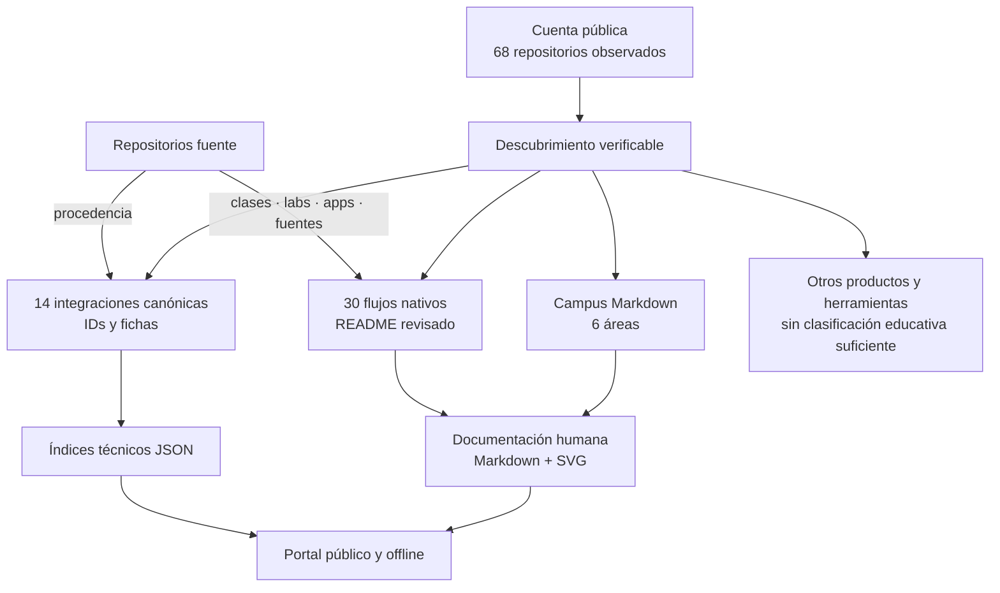
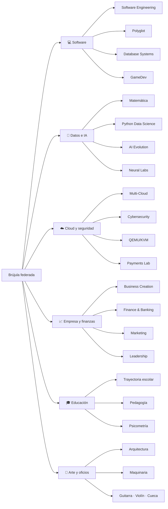
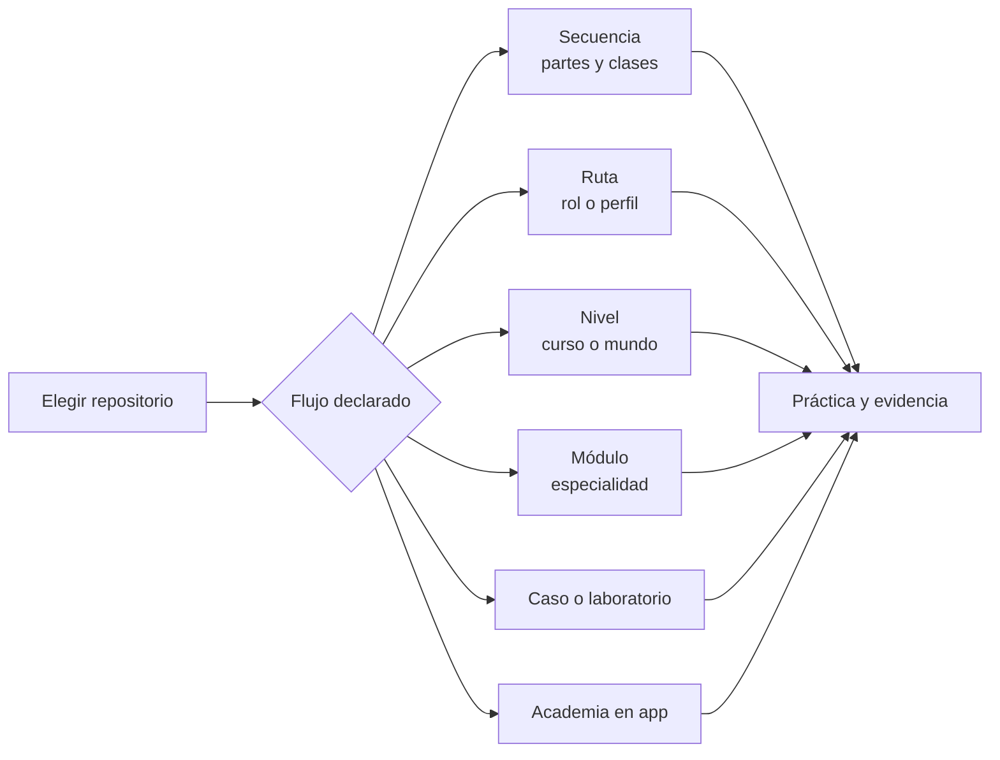
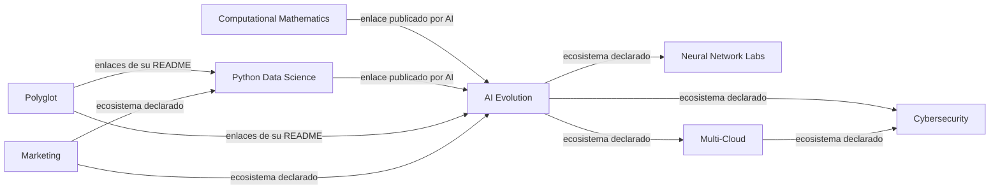
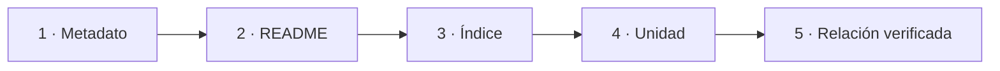
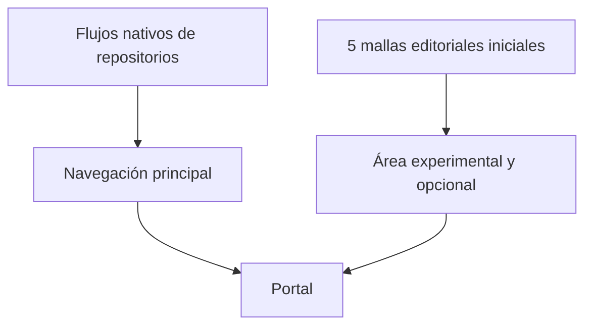

# 🗺️ Mapas del ecosistema

[← Abrir campus](CAMPUS.md) · [🛤️ Flujos nativos](NATIVE_LEARNING_FLOWS.md) · [📚 Atlas canónico](PROGRAM_ATLAS.md)

## Campus federado

Las áreas permiten orientarse; no sustituyen la estructura de cada repositorio. Algunos repositorios aparecen en más de un área porque su contenido cruza disciplinas.

## Arquitectura actual

### Enlaces de la arquitectura

- [Campus humano](CAMPUS.md)
- [30 flujos nativos](NATIVE_LEARNING_FLOWS.md)
- [14 integraciones canónicas](PROGRAM_ATLAS.md)
- [68 repositorios observados](../catalog/REPOSITORY_DISCOVERY.md)
- [Arquitectura implementada](CURRENT_ARCHITECTURE.md)
- [Componentes propuestos, todavía no implementados](../PROPOSED_COMPONENTS.md)

## Áreas y repositorios revisados

Enlaces: [software](faculties/SOFTWARE_COMPUTING.md) · [datos e IA](faculties/DATA_AI_SCIENCE.md) · [cloud y seguridad](faculties/CLOUD_SYSTEMS_SECURITY.md) · [empresa y finanzas](faculties/BUSINESS_FINANCE_LEADERSHIP.md) · [educación](faculties/EDUCATION_ASSESSMENT.md) · [arte y oficios](faculties/ARTS_SPACE_TRADES.md).

## Formas reales de recorrer contenido

La tabla completa con entradas directas está en [mallas y flujos nativos](NATIVE_LEARNING_FLOWS.md).

## Relaciones entre repositorios

Las flechas representan **enlaces observados en los README**, no prerrequisitos. El detalle y el alcance correcto están en [vínculos explícitos](NATIVE_LEARNING_FLOWS.md#-vínculos-entre-repositorios-que-sí-están-declarados).

## Escalera de evidencia

Solo el nivel 5 permite afirmar una continuidad o equivalencia curricular entre repositorios. La mayoría de conexiones transversales actuales permanece en los niveles 2 o 3.

## Lugar de M-01…M-05

Las cinco mallas editoriales no definen el campus, no representan la totalidad del ecosistema y ninguna es inicio predeterminado. Se conservan en [curricula](../curricula/README.md) para revisar sus actividades puente y correspondencias externas.
