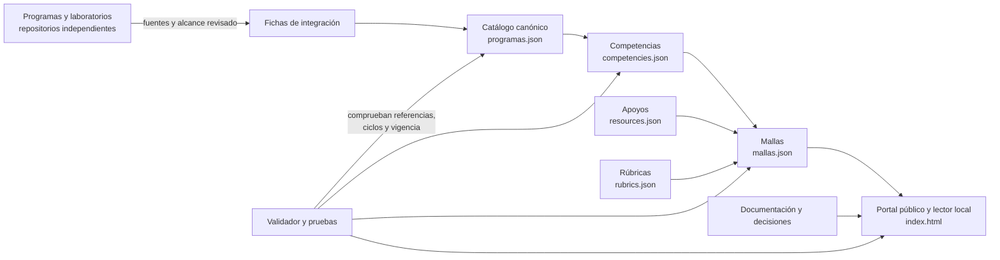
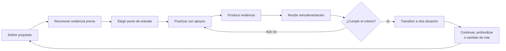
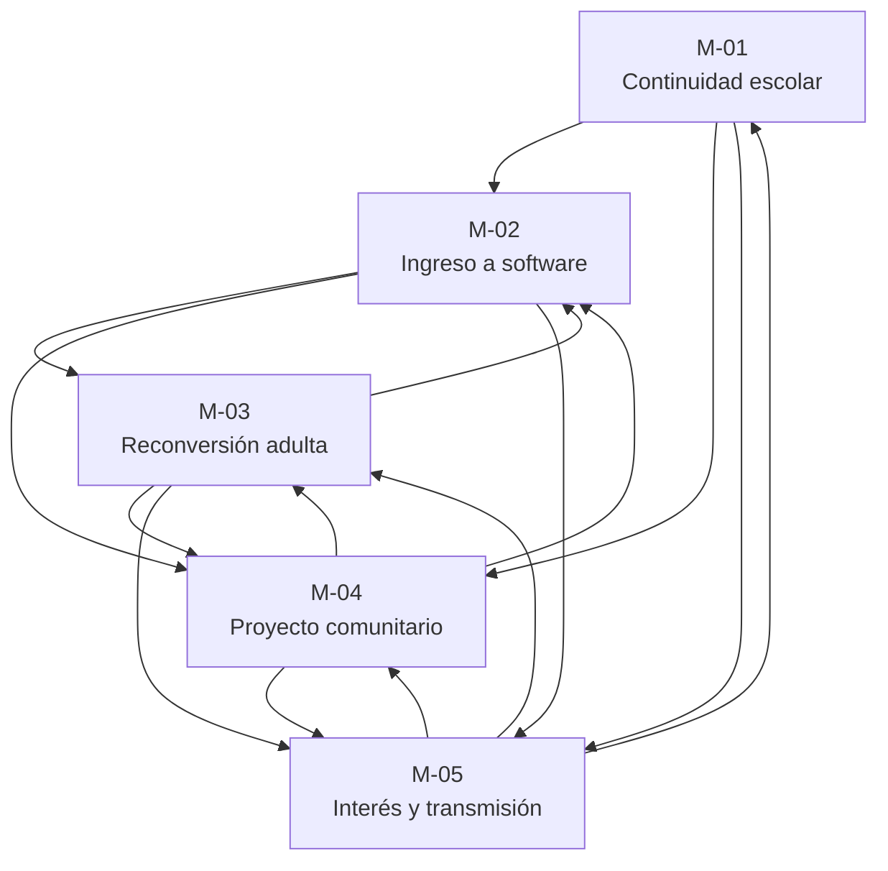

# Mapas del ecosistema

Este documento muestra cómo el superrepositorio conecta programas independientes sin absorberlos. Los JSON canónicos conservan el detalle; los diagramas explican la arquitectura y las transiciones editoriales de la versión 0.1.0.

## Arquitectura federada

Los repositorios de origen mantienen su contenido, numeración, licencia y evolución. El superrepositorio registra procedencia, propone puentes y organiza recorridos transversales.

## Ciclo de una trayectoria

La etapa vital orienta ejemplos y acompañamiento. El ingreso y el avance se justifican por competencias y evidencias pertinentes, no por edad.

## Continuidad entre las cinco mallas

Las flechas representan `next_routes`. Son opciones editoriales de continuidad y pueden formar ciclos; no son prerrequisitos obligatorios.

| Malla | Punto de entrada | Programas conectados | Pasos | Continuidad declarada |
| --- | --- | ---: | ---: | --- |
| M-01 · Continuidad escolar | Sin competencia obligatoria | 2 | 6 | M-02, M-04, M-05 |
| M-02 · Ingreso a software | Lectura y herramientas digitales | 3 | 6 | M-03, M-04, M-05 |
| M-03 · Reconversión adulta | Comunicación y lectura | 6 | 6 | M-02, M-04, M-05 |
| M-04 · Proyecto comunitario | Comunicación y lectura | 7 | 6 | M-02, M-03, M-05 |
| M-05 · Interés y transmisión | Sin competencia obligatoria | 4 | 6 | M-01, M-03, M-04 |

## Lectura de los estados

- **Programa identificado:** existe un `owner/name` y una fuente observada.
- **Correspondencia candidata:** la evidencia disponible se limita principalmente al README o a un índice.
- **Correspondencia verificada por unidad:** requiere leer contenido específico, resultados, actividades y requisitos de la unidad.
- **Diseño inicial de malla:** contiene actividades, evidencias y criterios utilizables para revisión; aún no demuestra eficacia educativa.

Consulta el [contrato de datos](DATA_CONTRACT.md), la [política de integración](INTEGRATION_POLICY.md) y el [estado de entrega](../quality/STATUS.md) antes de interpretar o ampliar estos mapas.
