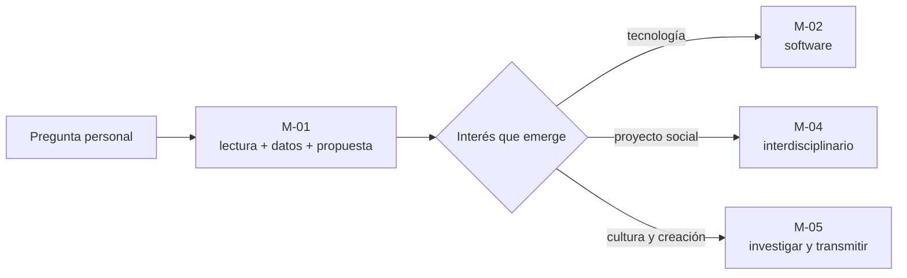
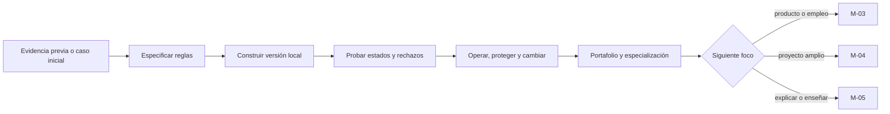
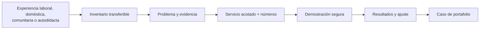
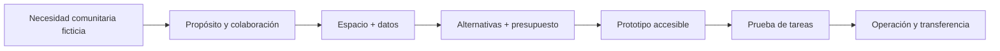
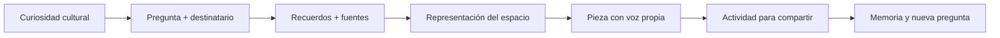

# Rutas de aprendizaje concretas

Una ruta es una decisión de uso; una malla es el recorrido documentado que la sostiene. Esta guía permite elegir por propósito y muestra exactamente qué se hace, qué se produce y qué programas participan.

## Elegir por meta

| Meta actual | Comienza en | Continúa hacia | Profundización posible |
| --- | --- | --- | --- |
| reforzar lectura, cantidades y autonomía | [M-01](../curricula/M-01-continuidad-escolar.md) | M-02, M-04 o M-05 | trayectoria escolar y matemática |
| comenzar o ordenar una formación en software | [M-02](../curricula/M-02-ingreso-especialidad-software.md) | M-03, M-04 o M-05 | software, ciberseguridad e IA |
| convertir experiencia en una opción profesional | [M-03](../curricula/M-03-reconversion-consultoria-tecnologica.md) | M-02, M-04 o M-05 | empresa, finanzas, marketing, liderazgo y tecnología |
| aprender construyendo una solución interdisciplinaria | [M-04](../curricula/M-04-proyecto-comunitario-tecnologico.md) | M-02, M-03 o M-05 | arquitectura, datos, software, finanzas y operación |
| aprender por curiosidad y enseñar lo aprendido | [M-05](../curricula/M-05-memoria-espacio-cultural.md) | M-01, M-03 o M-04 | arquitectura, currículo escolar, pedagogía y evaluación |
| estudiar redes neuronales de manera experimental | programa directo; todavía sin malla propia | construir primero bases en datos, matemática e IA | [Neural Network Training Labs](https://github.com/vladimiracunadev-create/neural-network-training-labs) |

## Ruta A: recuperar bases y descubrir una especialidad

**Entrada:** no exige una competencia obligatoria; admite lectura, escucha o representación visual.

**Recorrido M-01:**

1. Elegir una pregunta y un resultado observable.
2. Contrastar textos y separar información de interpretación.
3. Representar preferencias y decidir con un presupuesto ficticio.
4. Diseñar y comunicar una propuesta.
5. Probarla con otra persona y revisar una dificultad.
6. Seleccionar evidencias y decidir continuidad.

**Producto:** propuesta de rincón de lectura móvil, cálculos, registro de prueba y portafolio breve.

**Programas vinculados:** [Trayectoria Escolar Chile](https://github.com/vladimiracunadev-create/chilean-school-learning-path) y [Matemática Computacional](https://github.com/vladimiracunadev-create/computational-mathematics-program).

## Ruta B: entrar a ingeniería de software

**Entrada:** lectura de una especificación y manejo básico de archivos, con apoyos disponibles. La experiencia previa puede reemplazar práctica redundante cuando se demuestra el resultado y una variación.

**Recorrido M-02:**

1. Separar experiencia declarada, demostrada y pendiente.
2. Definir entradas, resultados, estados válidos e invariantes.
3. Construir un catálogo local pequeño.
4. Diseñar pruebas que detecten implementaciones incorrectas.
5. Preparar operación, recuperación y un cambio controlado.
6. Explicar decisiones y elegir una especialización.

**Producto:** programa local, especificación, pruebas, guía de operación y caso técnico de portafolio.

**Programas vinculados:** [Ingeniería de Software Moderna](https://github.com/vladimiracunadev-create/modern-software-engineering-program), [Ciberseguridad Moderna](https://github.com/vladimiracunadev-create/modern-cybersecurity-program) y [Evolución de la IA](https://github.com/vladimiracunadev-create/artificial-intelligence-evolution-program).

## Ruta C: reconversión profesional con evidencia

**Entrada:** experiencia demostrable de cualquier contexto. El caso es ficticio y no requiere contactar clientes ni usar datos privados.

**Recorrido M-03:**

1. Formular un objetivo profesional viable.
2. Separar síntomas, hechos, hipótesis e incógnitas.
3. Definir servicio, alcance, costos y alternativas.
4. Construir una demostración pequeña con datos protegidos.
5. Interpretar resultados sin generalizar un ensayo pequeño.
6. Presentar capacidad, límites y próximo aprendizaje.

**Producto:** propuesta simulada de una página, cálculo verificable, demostración, resultados y caso de portafolio.

**Programas vinculados:** [Empresa](https://github.com/vladimiracunadev-create/modern-business-creation-program), [Finanzas](https://github.com/vladimiracunadev-create/finance-and-banking-evolution-program), [Software](https://github.com/vladimiracunadev-create/modern-software-engineering-program), [Ciberseguridad](https://github.com/vladimiracunadev-create/modern-cybersecurity-program), [Marketing](https://github.com/vladimiracunadev-create/marketing-sales-growth-evolution-program) y [Liderazgo](https://github.com/vladimiracunadev-create/executive-leadership-founder-program).

## Ruta D: proyecto interdisciplinario

**Entrada:** elegir un rol —observar, escuchar, organizar, diseñar, construir o evaluar— y trabajar con el caso ficticio. Una implementación real requiere acuerdos con la comunidad.

**Recorrido M-04:**

1. Delimitar una necesidad y responsabilidades.
2. Representar el espacio y distinguir datos de supuestos.
3. Comparar soluciones, costos y límites.
4. Producir un prototipo con reglas de actualización.
5. Observar tareas y corregir una dificultad concreta.
6. Definir mantenimiento y presentar decisiones.

**Producto:** croquis, presupuesto, prototipo de información, prueba antes/después y plan operativo.

**Programas vinculados:** [Arquitectura](https://github.com/vladimiracunadev-create/architecture-built-environment-learning-program), [Software](https://github.com/vladimiracunadev-create/modern-software-engineering-program), [Ciberseguridad](https://github.com/vladimiracunadev-create/modern-cybersecurity-program), [Empresa](https://github.com/vladimiracunadev-create/modern-business-creation-program), [Finanzas](https://github.com/vladimiracunadev-create/finance-and-banking-evolution-program), [Python y Datos](https://github.com/vladimiracunadev-create/python-data-science-program) y [Liderazgo](https://github.com/vladimiracunadev-create/executive-leadership-founder-program).

## Ruta E: curiosidad, creación y transmisión

**Entrada:** interés personal; no exige experiencia profesional ni herramientas digitales.

**Recorrido M-05:**

1. Elegir una curiosidad y para quién se compartirá.
2. Contrastar recuerdos, fuentes e incertidumbres.
3. Crear un croquis, relato sonoro, maqueta u otra representación.
4. Producir una pieza con atribución y revisión.
5. Diseñar una experiencia para que otra persona participe.
6. Conservar el proceso y abrir una nueva pregunta.

**Producto:** tabla de fuentes, representación, pieza expresiva, guion de enseñanza y carpeta de proceso.

**Programas vinculados:** [Arquitectura](https://github.com/vladimiracunadev-create/architecture-built-environment-learning-program), [Trayectoria Escolar](https://github.com/vladimiracunadev-create/chilean-school-learning-path), [Pedagogía](https://github.com/vladimiracunadev-create/education-pedagogy-learning-sciences-program) y [Psicometría y Evaluación](https://github.com/vladimiracunadev-create/psychometrics-and-assessment-program).

## Rutas de profundización por disciplina

Las siguientes son orientaciones de entrada a repositorios, no nuevas mallas:

| Interés de profundización | Bases que conviene demostrar | Repositorios para revisar | Malla que ofrece un caso inicial |
| --- | --- | --- | --- |
| matemática y modelación | cantidades, representación y resolución de problemas | [Matemática Computacional](https://github.com/vladimiracunadev-create/computational-mathematics-program) | M-01 |
| software y arquitectura | especificación, construcción, pruebas y operación | [Software](https://github.com/vladimiracunadev-create/modern-software-engineering-program) | M-02 |
| seguridad digital | herramientas, riesgos y verificación de controles | [Ciberseguridad](https://github.com/vladimiracunadev-create/modern-cybersecurity-program) | M-02, M-03 o M-04 |
| datos e IA | datos, programación, matemática y evaluación | [Python y Datos](https://github.com/vladimiracunadev-create/python-data-science-program), [IA](https://github.com/vladimiracunadev-create/artificial-intelligence-evolution-program), [Neural Labs](https://github.com/vladimiracunadev-create/neural-network-training-labs) | M-02 o M-04; Neural Labs aún sin malla directa |
| empresa y finanzas | propuesta de valor, presupuesto, operación y evidencia | [Empresa](https://github.com/vladimiracunadev-create/modern-business-creation-program), [Finanzas](https://github.com/vladimiracunadev-create/finance-and-banking-evolution-program) | M-03 o M-04 |
| marketing y liderazgo | investigación, comunicación, coordinación y medición | [Marketing](https://github.com/vladimiracunadev-create/marketing-sales-growth-evolution-program), [Liderazgo](https://github.com/vladimiracunadev-create/executive-leadership-founder-program) | M-03 o M-04 |
| arquitectura y espacio | observación, representación, proyecto y contexto | [Arquitectura](https://github.com/vladimiracunadev-create/architecture-built-environment-learning-program) | M-04 o M-05 |
| enseñar y evaluar | comunicación, ética, evidencia y adaptación | [Pedagogía](https://github.com/vladimiracunadev-create/education-pedagogy-learning-sciences-program), [Psicometría](https://github.com/vladimiracunadev-create/psychometrics-and-assessment-program) | M-05 |

## Cómo decidir que una ruta funcionó

Una ruta no termina porque se leyeron documentos. Termina su ciclo cuando la persona:

1. produce la evidencia declarada;
2. explica qué ayuda utilizó;
3. revisa el resultado con criterios;
4. resuelve una variación o transfiere lo aprendido;
5. identifica con precisión qué sigue pendiente;
6. elige continuar, profundizar, cambiar de meta o pausar.

Consulta [el atlas](PROGRAM_ATLAS.md) antes de entrar a un repositorio especializado y [la guía de reconocimiento previo](../assessment/guides/RECONOCIMIENTO_PREVIO.md) para evitar repetir aprendizaje ya demostrado.
