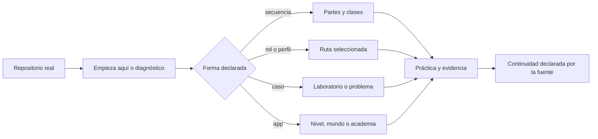

# 🛤️ Rutas de aprendizaje: cómo usar evidencia sin inventar una malla

La entrada principal es el [inventario de 30 flujos nativos](NATIVE_LEARNING_FLOWS.md). Allí cada ruta apunta a una secuencia, un índice, un módulo, un laboratorio o una app que el repositorio fuente realmente publica.

## Elegir por forma de aprendizaje

| Quiero… | Tipo de flujo | Ejemplos con enlace directo |
| --- | --- | --- |
| avanzar desde fundamentos en orden | secuencia | [software](https://github.com/vladimiracunadev-create/modern-software-engineering-program/tree/main/classes) · [ciberseguridad](https://github.com/vladimiracunadev-create/modern-cybersecurity-program/tree/main/classes) · [blockchain](https://github.com/vladimiracunadev-create/blockchain-learning-path/tree/main/curriculum) |
| estudiar según un rol | ruta | [pedagogía](https://github.com/vladimiracunadev-create/education-pedagogy-learning-sciences-program/tree/main/rutas) · [bases de datos](https://github.com/vladimiracunadev-create/database-systems-labs/tree/main/rutas) · [marketing](https://github.com/vladimiracunadev-create/marketing-sales-growth-evolution-program/tree/main/rutas) |
| elegir un nivel escolar | nivel | [trayectoria escolar](https://github.com/vladimiracunadev-create/chilean-school-learning-path) |
| profundizar en una familia técnica | módulo | [redes neuronales](https://github.com/vladimiracunadev-create/neural-network-training-labs/tree/main/parts) · [genómica](https://github.com/vladimiracunadev-create/human-genome-labs/blob/main/docs/MODULE_SYSTEM.md) |
| resolver un problema concreto | caso o laboratorio | [sistemas por problemas](https://github.com/vladimiracunadev-create/problem-driven-systems-lab/tree/main/cases) · [QEMU/KVM](https://github.com/vladimiracunadev-create/qemu-kvm-labs#ruta-de-aprendizaje) · [pagos](https://github.com/vladimiracunadev-create/universal-payments-engineering-lab/blob/main/docs/LEARNING_PATH.md) |
| aprender dentro de una app | academia local | [empresa](https://vladimiracunadev-create.github.io/empresa-operativa-chile/) · [guitarra](https://github.com/vladimiracunadev-create/guitarra-adventure/blob/main/docs/CURRICULUM.md) · [violín](https://github.com/vladimiracunadev-create/violin-adventure/blob/main/docs/CURRICULUM.md) · [cueca](https://github.com/vladimiracunadev-create/panuelo-al-viento-cueca-app/blob/main/docs/CURRICULUM.md) |

## Elegir por área

- [💻 Software y computación](faculties/SOFTWARE_COMPUTING.md)
- [🧠 Datos, IA y ciencia](faculties/DATA_AI_SCIENCE.md)
- [☁️ Cloud, sistemas y seguridad](faculties/CLOUD_SYSTEMS_SECURITY.md)
- [📈 Empresa, finanzas y liderazgo](faculties/BUSINESS_FINANCE_LEADERSHIP.md)
- [🎓 Escuela, pedagogía y evaluación](faculties/EDUCATION_ASSESSMENT.md)
- [🎨 Arte, espacio y oficios](faculties/ARTS_SPACE_TRADES.md)

## Rutas dentro de un repositorio

Cuando la fuente publica una ruta, se respeta su propia lógica:

## Pasar de un repositorio a otro

Un enlace temático ayuda a descubrir, pero no define una secuencia. Antes de publicar una transición como malla federada deben existir:

- unidad de salida identificada;
- resultado observable alcanzado;
- unidad de entrada identificada;
- requisito necesario o recomendado justificado;
- práctica de transferencia;
- criterio de revisión y continuidad.

Los enlaces cruzados que ya aparecen en README fuente están documentados en [vínculos explícitos](NATIVE_LEARNING_FLOWS.md#-vínculos-entre-repositorios-que-sí-están-declarados).

## Estado de M-01…M-05

Las cinco mallas en [curricula](../curricula/README.md) son propuestas editoriales experimentales del maestro. No representan todos los programas, no reemplazan sus rutas y ninguna se selecciona automáticamente. Permanecen para revisión porque contienen actividades puente y criterios, pero sus relaciones externas no se elevan a “verificadas” hasta auditar unidades concretas.

## Registrar una nueva malla con fundamento

Una nueva malla federada debe incluir:

1. repositorios exactos `owner/name`;
2. URLs de unidades y evidencias leídas;
3. propósito y público;
4. prerrequisitos necesarios y recomendados;
5. orden y motivo de cada transición;
6. actividad de transferencia;
7. producto o evidencia;
8. criterio de aceptación;
9. estado de revisión;
10. fecha y commit de las fuentes.

Sin esos campos puede registrarse como **conexión candidata**, pero no como malla implementada.
