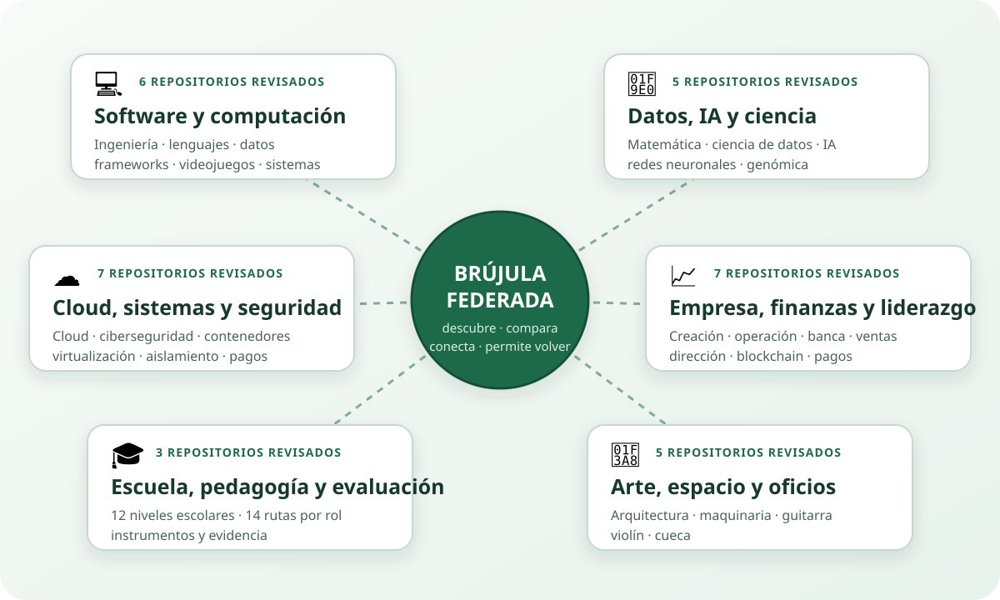
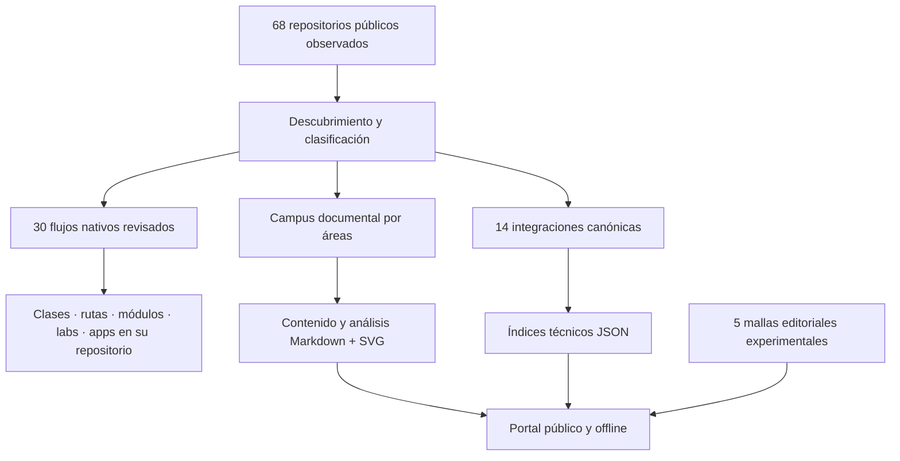
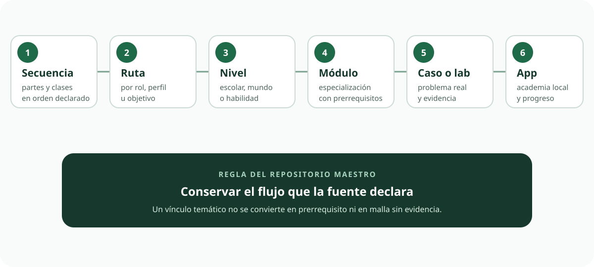
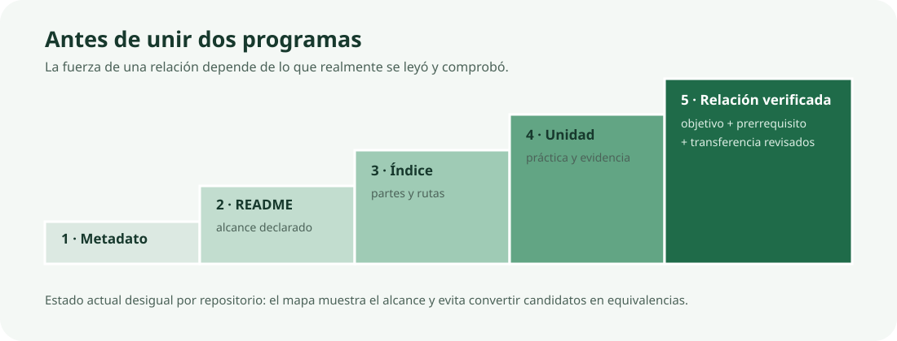

# Qué es este sistema de aprendizaje

## Propósito preciso

`lifelong-learning-ecosystem` es la **capa pública de orientación** para los programas, laboratorios y aplicaciones educativas que existen en la cuenta de Vladimir Acuña. El repositorio no intenta ser otro curso. Descubre el conjunto, explica cómo se recorre cada fuente, conserva su procedencia y permite comparar áreas sin mezclar sus contenidos.

Su unidad principal es el **repositorio de aprendizaje real y su flujo nativo**. Una malla editorial del maestro es una capa secundaria que solo puede apoyarse en unidades externas cuando esa correspondencia está revisada.

## Qué problema resuelve

Un perfil de GitHub ordena repositorios por nombre o fecha. Esa vista no responde:

- qué repositorios son programas, laboratorios, apps educativas o productos;
- qué profundidad, público y requisitos declara cada uno;
- si se estudia en orden, por rol, por nivel, por módulo o por caso;
- dónde están sus clases, laboratorios, evaluación y aplicación;
- qué otro repositorio enlaza la propia fuente;
- qué relación es solo temática y cuál está respaldada por unidades revisadas.

Este maestro ofrece esas respuestas en [el campus](CAMPUS.md), [los flujos nativos](NATIVE_LEARNING_FLOWS.md), [el atlas canónico](PROGRAM_ATLAS.md) y [el inventario completo](../catalog/REPOSITORY_DISCOVERY.md).

## Una analogía limitada con una universidad

La analogía sirve para imaginar la navegación:

| Campus o universidad | Este ecosistema |
| --- | --- |
| facultad o escuela | área documental que agrupa repositorios relacionados |
| programa de estudios | repositorio especializado con su propia estructura |
| malla | secuencia o ruta declarada por la fuente; también puede existir una propuesta editorial del maestro |
| laboratorio | repositorio o carpeta con práctica ejecutable |
| biblioteca y mapa del campus | este repositorio maestro y su portal |
| expediente personal | evidencia privada que cada persona conserva fuera del repositorio público |

La analogía termina allí. Este proyecto no matricula, no acredita, no entrega créditos ni títulos y no habilita una profesión.

## Arquitectura real

## Tres capas que no deben confundirse

### 1. Repositorios fuente

Contienen las clases, prácticas, fuentes, aplicaciones y decisiones disciplinares. Son la autoridad sobre su contenido.

### 2. Documentación del maestro

Está escrita en Markdown y SVG. Describe áreas, flujo nativo, público, profundidad, estado, enlaces y límites. Esta es la entrada humana al ecosistema.

### 3. Índices técnicos

Los JSON mantienen IDs, relaciones y campos que los validadores necesitan. Sirven al portal y a los controles automáticos. No sustituyen el texto educativo ni son el lugar para redactar una clase o una explicación.

## Más de una clase de malla

La revisión actual observa seis modelos reales: secuencia, ruta por rol o perfil, nivel, módulo, caso/laboratorio y academia dentro de una app. Cada repositorio conserva el suyo.

Las mallas `M-01`…`M-05` son propuestas editoriales iniciales creadas en este maestro. No son el inventario total, no definen la arquitectura y ninguna se elige por defecto. Su valor y sus límites se revisan por separado en [curricula](../curricula/README.md).

## Cómo se establece una relación

Un enlace en un README prueba que la fuente reconoce otro repositorio como parte de su ecosistema. Para convertirlo en continuidad educativa se necesita más:

1. leer el índice de ambos programas;
2. seleccionar las unidades de salida y entrada;
3. comparar sus objetivos y prerrequisitos;
4. revisar la práctica y la evidencia;
5. definir una tarea de transferencia;
6. registrar la relación y su alcance.

Mientras falte esa revisión, el portal presenta el vínculo como navegación, no como equivalencia ni requisito.

## Qué puede hacer una persona hoy

- elegir una de [seis áreas](CAMPUS.md#-áreas-del-campus);
- comparar [30 flujos nativos](NATIVE_LEARNING_FLOWS.md);
- abrir directamente la ruta, currículo, índice, laboratorio o app de un repositorio;
- distinguir programas existentes, contenido en desarrollo y laboratorios experimentales;
- revisar las 14 integraciones con ID en el [atlas](PROGRAM_ATLAS.md);
- utilizar apoyos y criterios editoriales sin confundirlos con acreditación;
- descargar el portal y leerlo sin conexión.

## Qué falta

La auditoría de cada unidad externa, las equivalencias verificadas y una cobertura canónica de todos los programas siguen pendientes. Un buscador transversal, recomendador, API, plataforma o agente no está implementado; esas posibilidades se analizan en [PROPOSED_COMPONENTS.md](../PROPOSED_COMPONENTS.md).
