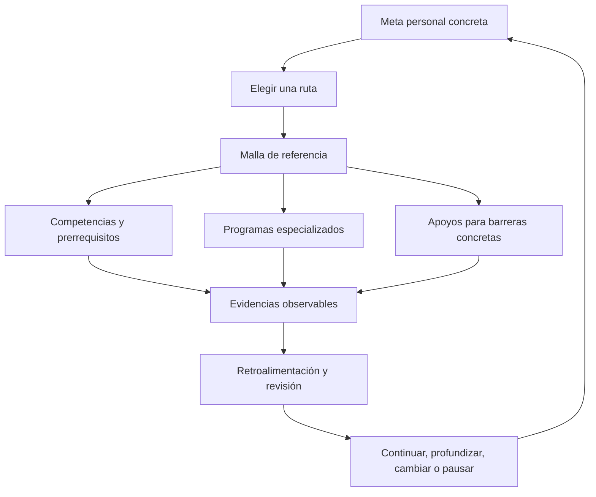
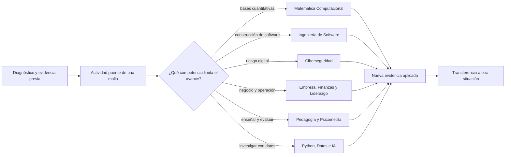

# La brújula de aprendizaje: qué es y por qué existe

## La respuesta corta

Este repositorio existe porque tener muchos programas de aprendizaje no basta. Una persona todavía necesita responder cuatro preguntas:

1. **¿Dónde empiezo con lo que ya sé?**
2. **¿Qué debo aprender antes de entrar a una especialidad?**
3. **¿Cómo conecto materias que viven en repositorios distintos?**
4. **¿Qué evidencia me permite decidir qué hacer después?**

`lifelong-learning-ecosystem` es la capa que responde esas preguntas. Funciona como una **brújula curricular federada**: no reemplaza los programas especializados; los ubica, explica su relación y propone recorridos concretos entre ellos.

## ¿Es una universidad?

Se puede usar la universidad como analogía organizativa, con límites importantes.

| En una universidad | En este ecosistema |
| --- | --- |
| Facultades o escuelas | Repositorios especializados independientes |
| Planes de estudio | Mallas de referencia del maestro |
| Asignaturas | Clases y unidades que permanecen en cada programa |
| Prerrequisitos | Dependencias entre competencias y pasos |
| Talleres y laboratorios | Actividades puente, proyectos y repositorios de laboratorio |
| Evaluación | Evidencias, criterios y rúbricas editoriales |
| Orientación académica | Guías de ingreso, reconocimiento previo, retorno y continuidad |

La analogía termina ahí. El repositorio **no es una institución acreditada**: no matricula, no asigna docentes, no entrega créditos, no homologa estudios y no emite títulos profesionales. Su función actual es más amplia que un índice y más acotada que una universidad: organiza aprendizaje verificable a través de fuentes distribuidas.

## El problema que resuelve

Los programas especializados crecen en profundidad, pero cada uno responde principalmente a su propia disciplina. Una persona rara vez aprende dentro de una sola frontera:

- software exige lectura, resolución de problemas, seguridad y comunicación;
- una reconversión combina experiencia previa, negocio, finanzas, tecnología y portafolio;
- un proyecto comunitario combina espacio, datos, presupuesto, participación y operación;
- enseñar algo exige comprenderlo, representarlo, observar evidencia y adaptar la explicación.

Sin el maestro, estas conexiones quedan implícitas. El usuario debe conocer de antemano los repositorios, interpretar sus estados y construir solo una secuencia. El maestro hace visibles esas decisiones y conserva sus límites.

## Las piezas del sistema

### Programa de aprendizaje

Es un repositorio especializado con profundidad disciplinar, clases, unidades, fuentes y, según el caso, proyectos, evaluaciones o herramientas. Mantiene su propia identidad y licencia. El maestro no copia su currículo.

Ejemplos actuales: [Ingeniería de Software Moderna](https://github.com/vladimiracunadev-create/modern-software-engineering-program), [Matemática Computacional](https://github.com/vladimiracunadev-create/computational-mathematics-program) y [Pedagogía, Docencia y Ciencias del Aprendizaje](https://github.com/vladimiracunadev-create/education-pedagogy-learning-sciences-program).

### Laboratorio

Es una superficie centrada en práctica o experimentación. Puede complementar un programa, pero no se presume que constituya por sí solo una trayectoria completa.

El catálogo canónico contiene [Laboratorios de Entrenamiento de Redes Neuronales](https://github.com/vladimiracunadev-create/neural-network-training-labs). Está relacionado con competencias de evaluación de modelos, pero todavía no participa en una de las cinco mallas. Esa ausencia es una brecha visible, no una integración implícita.

### Aplicación o herramienta de apoyo

El maestro actual no contiene una aplicación de tutoría ni un motor de recomendación. Algunos repositorios fuente declaran aplicaciones, notebooks, simuladores o herramientas, pero esta integración no los ejecutó salvo que se indique expresamente. En el maestro, los diez apoyos actuales son **guías documentales** para lectura, escritura, matemática, estudio, idiomas, investigación, accesibilidad, laboratorio, portafolio e IA.

### Competencia

Describe algo que una persona puede hacer y demostrar. Cada competencia tiene resultados observables, evidencias, prerrequisitos y seis niveles editoriales. La edad o el número de clases no determina el dominio.

### Malla

Es un recorrido completo alrededor de un propósito. Conecta diagnóstico, seis pasos, programas, apoyos, evidencias, criterios y opciones de continuidad. Las cinco mallas actuales son actividades integradoras listas para revisión, aunque sus correspondencias con clases externas siguen siendo candidatas.

### Ruta de aprendizaje

Es la decisión personal de cómo usar una o más mallas y cuándo entrar a un programa especializado. Una ruta puede comenzar en cualquier malla, reconocer experiencia previa, detenerse y retomarse. La [guía de rutas](LEARNING_ROUTES.md) muestra combinaciones concretas.

## Qué puede hacer una persona hoy

| Si la persona quiere… | Punto de entrada disponible | Resultado concreto |
| --- | --- | --- |
| recuperar bases y aprender a organizar una investigación pequeña | [M-01 · Continuidad escolar](../curricula/M-01-continuidad-escolar.md) | propuesta de rincón lector, comparación de fuentes, cálculos y revisión |
| entrar a software o demostrar experiencia previa | [M-02 · Ingreso a software](../curricula/M-02-ingreso-especialidad-software.md) | catálogo local con especificación, implementación, pruebas y operación |
| explorar una reconversión tecnológica | [M-03 · Reconversión](../curricula/M-03-reconversion-consultoria-tecnologica.md) | propuesta simulada de servicio, demostración y caso de portafolio |
| aprender mediante un problema interdisciplinario | [M-04 · Proyecto comunitario](../curricula/M-04-proyecto-comunitario-tecnologico.md) | prototipo de información accesible, prueba de tareas y plan operativo |
| investigar por interés y transmitir experiencia | [M-05 · Memoria cultural](../curricula/M-05-memoria-espacio-cultural.md) | indagación, pieza expresiva y actividad de enseñanza |

## Cómo se profundiza

La malla entrega el problema integrador y evidencia inicial. El programa especializado aporta profundidad disciplinar. El paso entre ambos debe justificarse:

No se recomienda estudiar un programa completo solo porque comparte una palabra con la meta. Primero se identifica el resultado que falta; después se seleccionan unidades reales del programa y se registra la versión revisada.

## Qué protege esta arquitectura

- **Autonomía:** la persona puede elegir propósito, medio y ritmo.
- **Continuidad:** una pausa no borra evidencias ni obliga a reiniciar todo.
- **Profundidad:** cada programa conserva su disciplina y no se reduce a una tarjeta genérica.
- **Accesibilidad:** los apoyos cambian el medio sin conceder automáticamente el mismo resultado.
- **Trazabilidad:** cada conexión distingue fuente observada, correspondencia candidata y revisión pendiente.
- **Honestidad:** una prueba técnica verde no demuestra eficacia educativa ni habilitación profesional.

## La idea central

Los programas responden **qué profundidad ofrece una disciplina**. Las mallas responden **cómo combinar disciplinas para conseguir algo**. Las competencias responden **qué debe poder demostrar la persona**. Las evidencias permiten decidir **qué sigue**.

Por eso este repositorio existe: transforma una colección de materiales en un sistema de orientación, conexión y continuidad sin apropiarse de sus fuentes ni prometer lo que todavía no está comprobado.

Continúa con [las rutas concretas](LEARNING_ROUTES.md), [el atlas de programas](PROGRAM_ATLAS.md) y [los mapas visuales](ECOSYSTEM_MAP.md).
