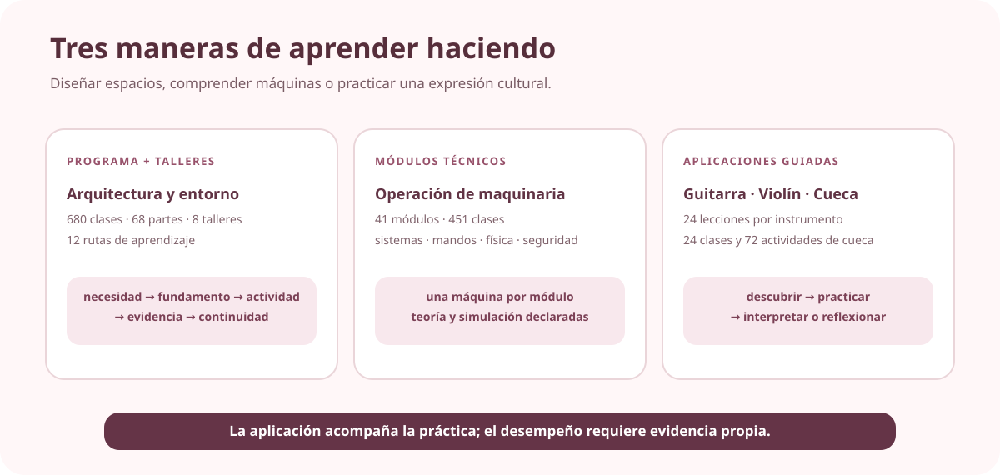

# 🎨 Arte, espacio y oficios

[← Volver al campus](../CAMPUS.md) · [Ver todos los flujos nativos](../NATIVE_LEARNING_FLOWS.md)

Esta área muestra la amplitud del ecosistema: una formación extensa en entorno construido, módulos técnicos por máquina y tres experiencias culturales guiadas por aplicaciones.

## 🧭 Mapa de elección

| Propósito | Repositorio | Flujo existente |
| --- | --- | --- |
| estudiar arquitectura y entorno construido | [`architecture-built-environment-learning-program`](https://github.com/vladimiracunadev-create/architecture-built-environment-learning-program) | 680 clases, 68 partes, 8 talleres y 12 rutas |
| comprender sistemas y seguridad de maquinaria | [`machine-operator-program`](https://github.com/vladimiracunadev-create/machine-operator-program) | 41 módulos y 451 clases |
| iniciarse en guitarra | [`guitarra-adventure`](https://github.com/vladimiracunadev-create/guitarra-adventure) | 24 lecciones en 6 mundos |
| iniciarse en violín | [`violin-adventure`](https://github.com/vladimiracunadev-create/violin-adventure) | 24 lecciones en 6 mundos |
| aprender una ruta introductoria de cueca | [`panuelo-al-viento-cueca-app`](https://github.com/vladimiracunadev-create/panuelo-al-viento-cueca-app) | 24 clases, 8 niveles y 72 actividades |

## 🏛️ Arquitectura y entorno construido

**Estado:** EXISTENTE. La fuente permite tres entradas: secuencia completa, parte temática o ruta.

- [12 rutas](https://github.com/vladimiracunadev-create/architecture-built-environment-learning-program/blob/main/docs/RUTAS_DE_APRENDIZAJE.md)
- [Índice de clases](https://github.com/vladimiracunadev-create/architecture-built-environment-learning-program/tree/main/classes)
- [Talleres](https://github.com/vladimiracunadev-create/architecture-built-environment-learning-program/tree/main/studios)
- **Cadena declarada por clase:** necesidad → fundamento → fuente → prerrequisitos → contenido → actividad → evidencia → continuidad.
- **Límite:** no procede de una carrera oficial ni declara acreditación profesional.

## 🕹️ Operación de maquinaria

**Estado:** EXISTENTE. El repositorio declara 41 módulos, uno por máquina, 451 clases y más de 500 horas.

- [Repositorio](https://github.com/vladimiracunadev-create/machine-operator-program)
- **Contenido observado:** sistemas, mandos, física, seguridad y simulación.
- **Límite:** esta revisión no establece requisitos legales ni habilitación para operar maquinaria real.

## 🎸 Guitarra y 🎻 violín

Ambas aplicaciones están **EXISTENTES**, funcionan offline y publican una progresión de 24 lecciones en seis mundos para iniciación desde 10 años.

- Guitarra: [currículo](https://github.com/vladimiracunadev-create/guitarra-adventure/blob/main/docs/CURRICULUM.md) · [repositorio](https://github.com/vladimiracunadev-create/guitarra-adventure)
- Violín: [currículo](https://github.com/vladimiracunadev-create/violin-adventure/blob/main/docs/CURRICULUM.md) · [repositorio](https://github.com/vladimiracunadev-create/violin-adventure)
- **Flujo:** mundo → lección → práctica guiada → herramientas de afinación/ritmo → avance local.
- **Límite:** la app acompaña la práctica; no demuestra por sí sola dominio interpretativo.

## 🧣 Cueca

**Estado:** EXISTENTE. La fuente declara una ruta introductoria adaptable de ocho semanas, 24 clases y 72 actividades.

- [Currículo](https://github.com/vladimiracunadev-create/panuelo-al-viento-cueca-app/blob/main/docs/CURRICULUM.md)
- [Repositorio](https://github.com/vladimiracunadev-create/panuelo-al-viento-cueca-app)
- **Flujo por clase:** mostrar o descubrir → practicar → interpretar o reflexionar.
- **Límite declarado:** complementa la guía de docentes y personas cultoras; no fija una coreografía única.

## 🔗 Conexiones pendientes

Espacio, cultura, movimiento, música y oficio comparten posibilidades de proyectos, pero ninguna secuencia transversal queda afirmada sin revisar unidades. Las experiencias artísticas conservan su contexto cultural y no se reducen a una competencia genérica.
