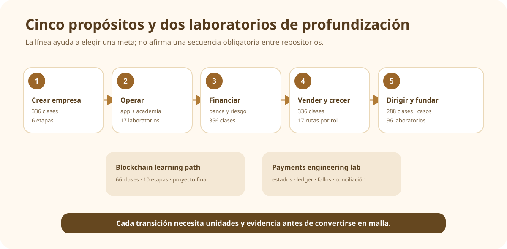

# 📈 Empresa, finanzas y liderazgo

[← Volver al campus](../CAMPUS.md) · [Ver todos los flujos nativos](../NATIVE_LEARNING_FLOWS.md)

Esta área reúne programas de creación, operación, finanzas, comercialización y dirección, además de laboratorios de blockchain y pagos. Los contenidos jurídicos, tributarios y financieros enlazan fuentes y casos, pero no sustituyen asesoría profesional.

## 🧭 Mapa de elección

| Propósito | Repositorio | Flujo existente |
| --- | --- | --- |
| crear y operar una empresa en Chile | [`modern-business-creation-program`](https://github.com/vladimiracunadev-create/modern-business-creation-program) | 336 clases, 24 partes y 6 etapas |
| practicar la operación con un motor y academia | [`empresa-operativa-chile`](https://github.com/vladimiracunadev-create/empresa-operativa-chile) | 17 partes, 70 clases y 17 labs en una app |
| profundizar en banca, riesgo y control | [`finance-and-banking-evolution-program`](https://github.com/vladimiracunadev-create/finance-and-banking-evolution-program) | 356 clases, 23 partes y casos |
| estudiar marketing, ventas y growth | [`marketing-sales-growth-evolution-program`](https://github.com/vladimiracunadev-create/marketing-sales-growth-evolution-program) | 336 clases, 24 partes y 17 rutas por rol |
| avanzar a liderazgo y dirección | [`executive-leadership-founder-program`](https://github.com/vladimiracunadev-create/executive-leadership-founder-program) | 288 clases, 24 partes, casos y labs |
| comprender blockchain de extremo a extremo | [`blockchain-learning-path`](https://github.com/vladimiracunadev-create/blockchain-learning-path) | 66 clases, 10 etapas, rutas por perfil y proyecto final |
| comprender ingeniería de pagos | [`universal-payments-engineering-lab`](https://github.com/vladimiracunadev-create/universal-payments-engineering-lab) | ruta guiada y demo local |

## 🏛️ Creación de empresas

**Estado:** EXISTENTE. La secuencia publicada va de idea y validación a constitución, operación, crisis y salida.

- [Currículo completo](https://github.com/vladimiracunadev-create/modern-business-creation-program/blob/main/CURRICULUM.md)
- **Profundidad declarada:** 336 clases, 360 diagramas, glosario y fuentes oficiales explicadas.
- **Límite:** la documentación educativa no reemplaza revisión legal, contable o tributaria aplicable al caso real.

## 🏢 Empresa Operativa Chile

**Estado:** EXISTENTE. La academia vive dentro de la aplicación y utiliza su motor real para explicar resultados.

- [Abrir aplicación](https://vladimiracunadev-create.github.io/empresa-operativa-chile/)
- [Currículo](https://github.com/vladimiracunadev-create/empresa-operativa-chile/tree/main/curriculum)
- [Laboratorios](https://github.com/vladimiracunadev-create/empresa-operativa-chile/tree/main/labs)
- **Flujo:** clase y explicación → práctica con el motor → evidencia del resultado.

## 🏦 Finanzas y banca

**Estado:** EXISTENTE. La fuente declara 356 clases, banca, riesgo, custodia, conciliación, tesorería, trading, control interno y gobernanza.

- [Ruta de aprendizaje](https://github.com/vladimiracunadev-create/finance-and-banking-evolution-program/blob/main/docs/ruta-aprendizaje.md)
- [Índice de clases](https://github.com/vladimiracunadev-create/finance-and-banking-evolution-program/blob/main/SYLLABUS.md)
- **Práctica:** casos y laboratorios digitales declarados.

## 📣 Marketing, ventas y growth

**Estado:** EXISTENTE. El programa publica 336 clases en 24 partes y 17 rutas por rol.

- [Rutas por rol](https://github.com/vladimiracunadev-create/marketing-sales-growth-evolution-program/tree/main/rutas)
- [Currículo](https://github.com/vladimiracunadev-create/marketing-sales-growth-evolution-program/tree/main/curriculum)
- **Vínculos explícitos del README:** cloud, ciberseguridad, IA, datos, blockchain y programación políglota.

## 👔 Liderazgo ejecutivo y founder track

**Estado:** EXISTENTE. La fuente describe un recorrido desde asumir un primer resultado hasta dirigir una empresa y crear una propia.

- [Ruta](https://github.com/vladimiracunadev-create/executive-leadership-founder-program/blob/main/docs/LEARNING_PATH.md)
- [Temario](https://github.com/vladimiracunadev-create/executive-leadership-founder-program/blob/main/SYLLABUS.md)
- **Práctica:** 24 casos, 96 laboratorios y 39 plantillas declaradas.

## ⛓️ Blockchain y pagos

[`blockchain-learning-path`](https://github.com/vladimiracunadev-create/blockchain-learning-path) ofrece [empieza aquí](https://github.com/vladimiracunadev-create/blockchain-learning-path/blob/main/docs/empieza-aqui.md), 66 clases secuenciales, [rutas por perfil](https://github.com/vladimiracunadev-create/blockchain-learning-path/tree/main/learning-paths), laboratorios y un proyecto final. [`universal-payments-engineering-lab`](https://github.com/vladimiracunadev-create/universal-payments-engineering-lab) ofrece una [ruta de aprendizaje](https://github.com/vladimiracunadev-create/universal-payments-engineering-lab/blob/main/docs/LEARNING_PATH.md) centrada en estados, ledger, fallos y conciliación.

## 🔗 Conexiones pendientes

La secuencia “crear → operar → financiar → vender → dirigir” es una organización conceptual útil, pero no se publica como prerrequisito verificado entre esos repositorios. Cada transición necesita unidades concretas y un producto de transferencia revisado.
