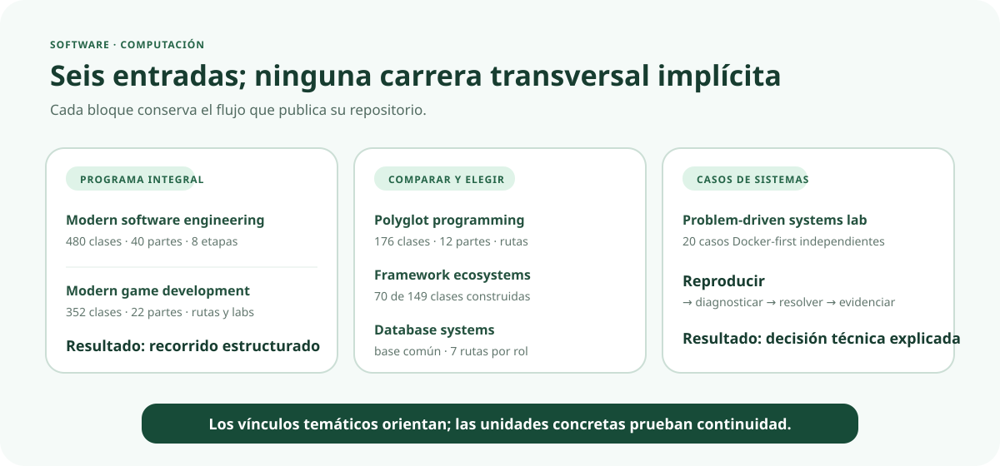

# 💻 Software y computación

[← Volver al campus](../CAMPUS.md) · [Ver todos los flujos nativos](../NATIVE_LEARNING_FLOWS.md)

Esta área contiene seis repositorios revisados. No forman una carrera única: cada uno ofrece una profundidad y una forma de entrada distintas. Las continuidades solo se consideran verificadas dentro de la secuencia declarada por cada fuente.

## 🧭 Mapa de elección

| Necesidad | Repositorio | Flujo existente |
| --- | --- | --- |
| recorrer el ciclo completo de construir y operar software | [`modern-software-engineering-program`](https://github.com/vladimiracunadev-create/modern-software-engineering-program) | 480 clases, 40 partes, 8 etapas y rutas por rol |
| comparar paradigmas y lenguajes | [`polyglot-programming-labs`](https://github.com/vladimiracunadev-create/polyglot-programming-labs) | 176 clases, 12 partes y rutas por perfil |
| comparar frameworks con el mismo contrato | [`framework-ecosystems-labs`](https://github.com/vladimiracunadev-create/framework-ecosystems-labs) | 149 clases previstas; 70 construidas |
| comprender motores y operación de datos | [`database-systems-labs`](https://github.com/vladimiracunadev-create/database-systems-labs) | 74 clases, 15 partes, base común y 7 rutas por rol |
| crear videojuegos y especializarse | [`modern-gamedev-program`](https://github.com/vladimiracunadev-create/modern-gamedev-program) | 352 clases, 22 partes, rutas, labs y autoevaluación |
| practicar diagnóstico de sistemas | [`problem-driven-systems-lab`](https://github.com/vladimiracunadev-create/problem-driven-systems-lab) | 20 casos independientes Docker-first |

## 🧱 Ingeniería de software moderna

**Estado:** EXISTENTE. El README declara 480 clases en 40 partes y ocho etapas, desde fundamentos hasta producto, arquitectura, DevOps e IA.

- **Entrada general:** [índice de clases](https://github.com/vladimiracunadev-create/modern-software-engineering-program/tree/main/classes).
- **Entrada por objetivo profesional:** [rutas por rol](https://github.com/vladimiracunadev-create/modern-software-engineering-program/tree/main/roles).
- **Práctica y evidencia:** cada clase declara aprendizaje conectado, práctica y evidencia; el maestro todavía no ha auditado todas las unidades.
- **Límite:** el nombre de una ruta profesional no acredita experiencia laboral ni habilitación.

## 🌐 Programación políglota

**Estado:** EXISTENTE. La fuente declara 176 clases en 12 partes, implementaciones comparadas y rutas por perfil.

- **Entrada secuencial:** [índice de clases](https://github.com/vladimiracunadev-create/polyglot-programming-labs/tree/main/classes).
- **Entrada por perfil:** [rutas](https://github.com/vladimiracunadev-create/polyglot-programming-labs/tree/main/rutas).
- **Vínculos explícitos del README:** matemática computacional, Python y ciencia de datos, evolución de IA y laboratorio de sistemas por problemas.
- **Límite:** esos vínculos sirven para navegar; no fijan un orden transversal revisado.

## 🧩 Ecosistemas de frameworks

**Estado:** EN DESARROLLO. El README declara 149 clases previstas en 12 partes y 70 construidas.

- **Entrada:** [currículo](https://github.com/vladimiracunadev-create/framework-ecosystems-labs/tree/main/curriculum).
- **Método observable:** ejecutar el mismo contrato sin adaptadores contra distintos frameworks.
- **Práctica:** laboratorios, proyectos y evaluaciones declarados; 397 casos CI declarados.
- **Límite:** las clases planificadas no se presentan como disponibles.

## 🗄️ Ingeniería de bases de datos

**Estado:** EXISTENTE. La fuente publica 74 clases en 15 partes y separa una base común de siete rutas por rol.

- **Comenzar desde cero:** [clase 001](https://github.com/vladimiracunadev-create/database-systems-labs/tree/main/classes/part-00-primeros-pasos-del-archivo-a-la-base-de-datos/001-que-es-un-dato-un-registro-y-una-tabla).
- **Elegir especialización:** [rutas por rol](https://github.com/vladimiracunadev-create/database-systems-labs/tree/main/rutas).
- **Practicar:** [laboratorios](https://github.com/vladimiracunadev-create/database-systems-labs/tree/main/labs).
- **Evidencia estructural:** el currículo declara resumen y prerrequisitos por clase; el maestro todavía no los normaliza.

## 🎮 Desarrollo de videojuegos

**Estado:** EXISTENTE. La fuente declara 352 clases completas en 22 partes, diez laboratorios y rutas de especialización.

- **Entrada secuencial:** [clases](https://github.com/vladimiracunadev-create/modern-gamedev-program/tree/main/classes).
- **Entrada por especialidad:** [rutas](https://github.com/vladimiracunadev-create/modern-gamedev-program/tree/main/rutas).
- **Práctica verificable:** [laboratorios](https://github.com/vladimiracunadev-create/modern-gamedev-program/tree/main/labs), incluidos 2D, 3D, shaders, multijugador, IA y UI accesible.
- **Límite declarado:** la CI valida los proyectos de laboratorio; el código incrustado en las clases no se ejecuta automáticamente.

## 🧪 Sistemas guiados por problemas

**Estado:** EXISTENTE. Contiene 20 casos sobre rendimiento, observabilidad, resiliencia y arquitectura.

- **Entrada:** [catálogo de casos](https://github.com/vladimiracunadev-create/problem-driven-systems-lab/tree/main/cases).
- **Flujo correcto:** elegir un problema, reproducirlo, diagnosticar y resolverlo.
- **Límite:** el README no declara que el caso 1 sea prerrequisito del 2; no se dibuja una secuencia inexistente.

## 🔗 Conexiones pendientes de auditar

La afinidad entre lenguajes, frameworks, bases de datos y software es clara como **dominio**, pero la continuidad educativa exige seleccionar unidades. Una futura malla federada deberá indicar qué clase de salida de un repositorio satisface qué entrada concreta del siguiente.
